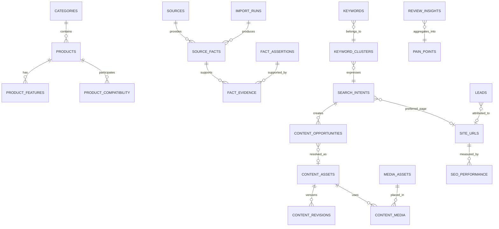

# PHASE 2 — SEO & Content Intelligence Data Architecture

Статус: **PROPOSED / HUMAN REVIEW REQUIRED**  
Дата: 24 августа 2026 года  
Scope: логическая и физическая модель данных. Миграции не применялись.

## 1. Architecture decisions

### ADR-001 — Commerce core remains authoritative for commerce facts

Существующие `products`, `variants`, `categories`, `subcategories` остаются commerce core. SEO-платформа не владеет ценой, остатком, SKU, barcode или supplier availability и не должна переписывать их.

До PHASE 3 необходимо выбрать authoritative storage между production SQLite, `products.json` и supplier feed. Предлагаемая иерархия после reconciliation:

1. supplier feed/raw import — источник полученных supplier facts;
2. normalized SQLite commerce core — operational source of truth;
3. JSON snapshot — производный build artifact, не master data;
4. SEO fact layer — проверенные утверждения с provenance, не копия всего Product.

### ADR-002 — Facts are immutable observations, assertions are publishable claims

Полученное значение хранится как `source_fact`. Решение использовать его публично хранится отдельно как `fact_assertion`. Это позволяет:

- видеть историю изменения фида;
- не терять ручную верификацию;
- не смешивать «поставщик прислал» и «7TOOL подтверждает»;
- блокировать конфликтующие или устаревшие значения.

### ADR-003 — Every publishable claim needs evidence

Любая характеристика, совместимость, расчёт, ограничение или технический совет имеет `evidence_status`:

`FACT_REQUIRED` → `SOURCED` → `VERIFIED` → `SUPERSEDED`/`REJECTED`.

Только `VERIFIED` допускается в автоматический publish layer. Цена и наличие используют отдельную live-commerce политику.

### ADR-004 — One intent maps to one preferred URL

`search_intents.preferred_url_id` — центральный anti-cannibalization constraint. Несколько keywords могут относиться к одному intent; один URL может закрывать несколько близких clusters; новая opportunity не создаёт URL автоматически.

### ADR-005 — External research is summarized, not mirrored

Для reviews/SERP/competitors хранятся URL, metadata, агрегированные insights и короткое допустимое evidence snippet. Полные чужие статьи, отзывы и изображения не являются рабочей единицей платформы.

### ADR-006 — Media rights are a hard gate

MediaAsset отделяет origin от publishable derivative. `RESEARCH_ONLY` нельзя связать с public content slot. Статус прав имеет приоритет над quality score.

### ADR-007 — Workflow state and approvals are append-audited

Текущий статус хранится на entity для быстрых запросов; каждое изменение фиксируется в `workflow_events`. Переход `CONTENT_DRAFT → PUBLISHED` запрещён для AI actor и требует human/expert approval.

## 2. Cross-cutting conventions

- Primary keys новых сущностей: ULID/UUID text; существующие commerce ids не изменяются.
- Timestamps: Unix milliseconds UTC (`INTEGER`) для совместимости с текущей БД.
- Enum: `TEXT` + `CHECK`, не числовые magic values.
- Soft lifecycle: `status`, `archived_at`; физическое удаление только через retention workflow.
- JSON разрешён для raw payload/rare extension fields, но не для ключевых связей, фильтров и evidence.
- Все source imports имеют `import_run_id`, checksum, fetched_at и parser_version.
- PII хранится только в lead domain; SEO/performance entities не содержат телефон/email.
- Public URL хранится без domain в `site_urls.path`; environment domain задаётся конфигурацией.
- Веса scoring versioned; итоговый score хранится вместе с `score_model_version` и component breakdown.

## 3. Entity map

Названия `PRODUCTS`, `CATEGORIES`, `LEADS` на диаграмме соответствуют существующим таблицам.

## 4. Source and provenance domain

### `sources`

| Field | Type | Notes |
|---|---|---|
| id | TEXT PK | stable id |
| source_type | TEXT | SUPPLIER_FEED, MANUFACTURER, MANUAL, GSC, YANDEX_WEBMASTER, WORDSTAT, MARKETPLACE, SERP, INTERNAL_SEARCH |
| name | TEXT | human label |
| base_url | TEXT NULL | no credentials |
| rights_policy | TEXT | PUBLISHABLE_FACTS, RESEARCH_ONLY, CONTRACT_REQUIRED |
| active | INTEGER | boolean |
| created_at, updated_at | INTEGER | UTC ms |

### `import_runs`

`id`, `source_id`, `started_at`, `completed_at`, `status`, `input_checksum`, `record_count`, `rejected_count`, `parser_version`, `schema_version`, `error_summary`, `artifact_ref`.

`artifact_ref` указывает на защищённое raw storage; raw payload не складывается бесконтрольно в SQLite.

### `source_facts`

`id`, `source_id`, `import_run_id`, `subject_type`, `subject_id`, `predicate`, `value_text`, `value_number`, `unit`, `value_json`, `valid_from`, `observed_at`, `source_locator`, `checksum`, `status`.

Unique candidate: `(source_id, subject_type, subject_id, predicate, checksum)`.

### `fact_assertions`

`id`, `subject_type`, `subject_id`, `predicate`, typed value fields, `verification_status`, `confidence`, `verified_by`, `verified_at`, `valid_from`, `valid_to`, `supersedes_id`, `notes`.

### `fact_evidence`

Join: `assertion_id`, `source_fact_id`, `evidence_role` (PRIMARY/SUPPORTING/CONFLICTING), `created_at`.

## 5. Product knowledge domain

### `product_features`

`id`, `product_id`, optional `variant_id`, `feature_key`, typed value, `unit`, `assertion_id`, `status`, `sort_order`.

Нельзя дублировать price/stock здесь.

### `product_applications`

`id`, `product_id`, `application_key`, `suitability` (SUPPORTED/BETTER_FOR/NOT_RECOMMENDED/UNKNOWN), `assertion_id`, `status`.

### `product_problems`

`id`, `product_id` nullable, `category_slug` nullable, `problem_id`, `relation_type`, `assertion_id`, `status`.

### `knowledge_relations`

`id`, `subject_type`, `subject_id`, `predicate`, `object_type`, `object_id`, `assertion_id`, `verification_status`, `valid_from`, `valid_to`, `created_at`, `updated_at`.

Allowed initial predicates: USES, COMPATIBLE_WITH, REQUIRES, ALTERNATIVE_TO, BETTER_FOR, NOT_RECOMMENDED_FOR, SUPPORTS, DRILLS, CUTS, BEVELS, THREADS, MOUNTS_ON, HAS_SHANK, HAS_DIAMETER, HAS_DEPTH, USES_ACCESSORY.

### `product_compatibility`

Dedicated indexed projection for high-value queries:

`id`, `product_a_id`, `product_b_id`, `compatibility_type`, `compatibility_status` (COMPATIBLE/INCOMPATIBLE/CONDITIONAL/UNKNOWN), `assertion_id`, `verified`, `verified_by`, `verified_at`, `notes`, timestamps.

Unique candidate: `(product_a_id, product_b_id, compatibility_type)`; order must be normalized for symmetric types.

## 6. Semantic intelligence domain

### `seo_keywords`

Fields from master prompt plus operational fields: `id`, `query`, `normalized_query`, `source_id`, `source_keyword_id`, `region`, `language`, `frequency`, `exact_frequency`, `seasonality_json`, `category_slug`, `product_id`, `intent_id`, `cluster_id`, `commercial_score`, `business_value`, `opportunity_score`, `existing_url_id`, `cannibalization_risk`, `status`, `first_seen_at`, `last_seen_at`, timestamps.

Unique candidate: `(normalized_query, source_id, region, language)`.

### `keyword_clusters`

`id`, `name`, `category_slug`, `centroid_text`, `cluster_method`, `model_version`, `status`, `created_at`, `updated_at`.

### `search_intents`

`id`, `intent_key`, `label`, `intent_class`, `dominant_serp_type`, `category_slug`, `preferred_url_id`, `status`, `reviewed_by`, `reviewed_at`, timestamps.

### `site_urls`

Canonical registry всех indexable и relevant non-indexable URL:

`id`, `path`, `page_type`, `entity_type`, `entity_id`, `canonical_url_id`, `index_status`, `http_status`, `content_fingerprint`, `last_crawled_at`, `published_at`, timestamps.

Unique: normalized `path`. Cyclic canonical запрещён application validation.

### `content_opportunities`

`id`, `topic`, `category_slug`, `cluster_id`, `intent_id`, `primary_keyword_id`, demand signals, SERP type, pain/business/product/margin/competition/gap/cannibalization/differentiation components, `recommended_page_type`, `recommended_url_id`, `decision` (CREATE/UPDATE/MERGE/REJECT), `opportunity_score`, `score_model_version`, `score_breakdown_json`, `decision_reason`, `status`, review fields, timestamps.

## 7. Review and pain intelligence domain

### `review_insights`

`id`, `source_id`, `source_url`, `source_product_ref`, `product_id`, `category_slug`, `insight_type`, `normalized_text`, `evidence_snippet`, `rating_bucket`, `aggregate_count`, `observed_at`, `rights_status`, `status`.

`evidence_snippet` имеет length limit и internal-only policy.

### `pain_points`

`id`, `category_slug`, `product_type`, `problem_key`, `problem`, `mentions`, `sources_count`, `severity`, `commercial_relevance`, `keyword_match_score`, `content_url_id`, `suggested_content_type`, `priority`, `status`, timestamps.

### `pain_point_sources`

Join для platform/source/count/last_seen без хранения массива source_platforms в JSON.

## 8. Content domain

### `content_assets`

Унифицированная оболочка ARTICLE, GUIDE, HOW_TO, COMPARISON, TROUBLESHOOTING, TABLE, CALCULATOR, COMPATIBILITY, CASE_STUDY, TEST, REFERENCE, CATEGORY_ENRICHMENT, PRODUCT_ENRICHMENT, FAQ, VIDEO, SEO_LANDING.

Поля: `id`, `content_type`, `site_url_id`, `opportunity_id`, `status`, `title`, `h1`, `meta_title`, `meta_description`, `excerpt`, `category_slug`, `primary_keyword_id`, `intent_id`, `cluster_id`, `author_id`, `expert_reviewer_id`, `canonical_url_id`, `index_status`, quality/evidence/differentiation/business scores, `generated_by_ai`, `human_reviewed`, publish/update timestamps.

### `article_briefs`

`id`, `content_asset_id`, intent/problem/audience/short_answer, required questions/tables/calculator/diagrams/CTA, `status`, `approved_by`, `approved_at`, timestamps. Multi-value relations хранятся join tables, не только JSON.

### `content_revisions`

`id`, `content_asset_id`, `revision_number`, `content_format`, `content_body`, `content_hash`, `created_by_actor_type`, `created_by_actor_id`, `created_at`.

### Supporting joins

`content_products`, `content_related`, `content_sources`, `content_faq`, `content_internal_links`, `content_media`, `content_approvals`, `workflow_events`, `content_publish_queue`.

Publish transaction must verify:

- quality ≥85;
- no hard fail;
- evidence/differentiation thresholds;
- canonical and route validity;
- cannibalization != HIGH;
- human approval;
- media rights publishable.

## 9. Media domain

### `media_assets`

`id`, `source_id`, `source_type`, supplier/product/category/brand references, `origin_url`, `storage_key`, `sha256`, `perceptual_hash`, `width`, `height`, `mime`, `copyright_status`, `license_status`, `rights_verified_by`, `rights_verified_at`, `alt_default`, `component`, `application`, `problem`, `status`, timestamps.

### `media_tags`, `media_relations`, `media_variants`

Tags нормализованы; relations связывают asset с products/categories/content; variants хранят width/format/storage_key/bytes/checksum/generation status.

Hard constraint: `license_status IN (VERIFIED, OWNED, CONTRACT_APPROVED)` для public `content_media`.

## 10. People and review ownership

### `experts`

`id`, real `name`, `photo_media_id`, `specialization`, `experience_text`, `active`, timestamps. Не создавать фиктивные profiles.

### `expert_categories`, `expert_brands`

Join tables задают scope review.

### Actors

Существующие `users` остаются admin identities. Automated actors регистрируются отдельно в `system_actors`; workflow event всегда показывает HUMAN, SYSTEM, AI_ASSISTED или IMPORT.

## 11. Performance and lead domain

### `seo_performance_daily`

`date`, `source`, `site_url_id`, optional keyword/query hash, country, region, device, impressions, clicks, ctr, average_position, organic_sessions, product_clicks, leads, quotes, orders, revenue, margin. Grain обязателен и документируется; агрегаты разных grain не смешиваются.

### Lead attribution extension

Не ломая `leads`, добавить nullable FK: `site_url_id`, `content_asset_id`, `opportunity_id`, `cluster_id`, `intent_id`, `cta_key`. Quote/order/revenue лучше хранить в `lead_outcomes` с history, а не постоянно расширять `leads`.

## 12. Scoring architecture

### `score_models`

`id`, `score_type`, `version`, `weights_json`, `thresholds_json`, `active_from`, `approved_by`, `approved_at`.

### `entity_scores`

`entity_type`, `entity_id`, `score_type`, `score`, `model_id`, `components_json`, `calculated_at`.

Weights configurable, но изменение требует новой immutable version. Нельзя пересчитать историю без сохранения предыдущей модели.

## 13. Index and retention strategy

Обязательные индексы проектируются по access patterns:

- facts by subject/predicate/status;
- relations by subject and object;
- keyword normalized/source/region and cluster;
- intent preferred URL;
- opportunity category/status/score;
- content status/type/publish queue;
- performance date/source/url;
- media checksum/rights/status;
- workflow entity/time.

Raw imports и query-level performance partition/retention определяются до подключения API. PII retention согласуется юридически. Research snippets/media никогда не попадают в public export.

## 14. Migration contract

Текущий `src/lib/db.ts` создаёт/расширяет схему при runtime open, а `schema_version` фактически не управляет последовательностью. Перед SEO tables нужен отдельный runner:

1. numbered immutable migrations;
2. checksum and applied_at registry;
3. `BEGIN IMMEDIATE` transaction where SQLite permits;
4. preflight: DB path, writable space, integrity check, expected prior version;
5. mandatory backup reference for production;
6. forward migration + explicit down/recovery procedure;
7. postflight integrity, FK check, schema snapshot and smoke tests;
8. application refuses unknown newer schema.

SQLite caveat: destructive rollback чаще выполняется table-copy migration или restore backup. Поэтому «reversible» означает проверенный recovery path, а не обещание простого `DROP COLUMN`.

## 15. Proposed migration batches

Миграции PHASE 3–4 созданы как backup-gated artifacts, но к production не применены.

| Batch | Scope | Dependency | Gate |
|---|---|---|---|
| 001 | sources, import_runs, source_facts + migration registry bootstrap | authoritative store | PHASE 3 approval |
| 002 | assertions/evidence/features/relations/compatibility | source facts | PHASE 4 approval |
| 004 | URLs/keywords/clusters/intents | URL crawl + source access | PHASE 5 approval |
| 005 | review insights/pain points | legal/API policy | PHASE 6 approval |
| 006 | opportunities/scoring | semantic + SERP data | PHASE 8 approval |
| 007 | content/workflow/media joins | editorial roles | PHASE 9/10 approval |
| 008 | performance/outcomes | analytics/CRM contracts | PHASE 18 approval |

## 16. API boundaries

- Feed adapter writes only raw/staged facts and commerce sync commands.
- Fact service resolves conflicts and produces verified assertions.
- Semantic service never writes public content.
- Content service reads verified assertions and workflow permissions.
- Publishing service is the only writer of published URL state.
- Analytics ingestion is append/idempotent by source/date/grain.
- Public frontend reads curated projections, never raw review/SERP payloads.

## 17. Open decisions

1. Confirm SQLite remains suitable for expected raw query/performance volume or approve PostgreSQL for intelligence data while commerce stays SQLite.
2. Confirm production source-of-truth and provide sanitized schema/data snapshot.
3. Approve ULID vs UUID.
4. Define expert/editor/admin roles and publish approvers.
5. Define media rights statuses with legal owner.
6. Define retention for raw imports, review snippets, query facts and lead PII.
7. Confirm whether build artifact continues to be JSON or moves to DB-backed rendering/cache.

# STOP / HUMAN REVIEW REQUIRED
