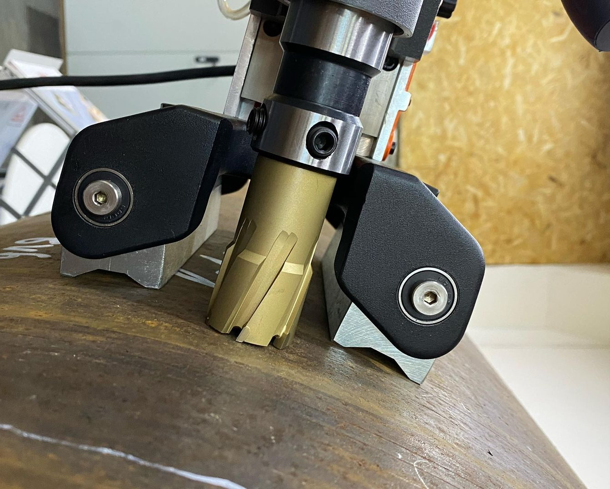
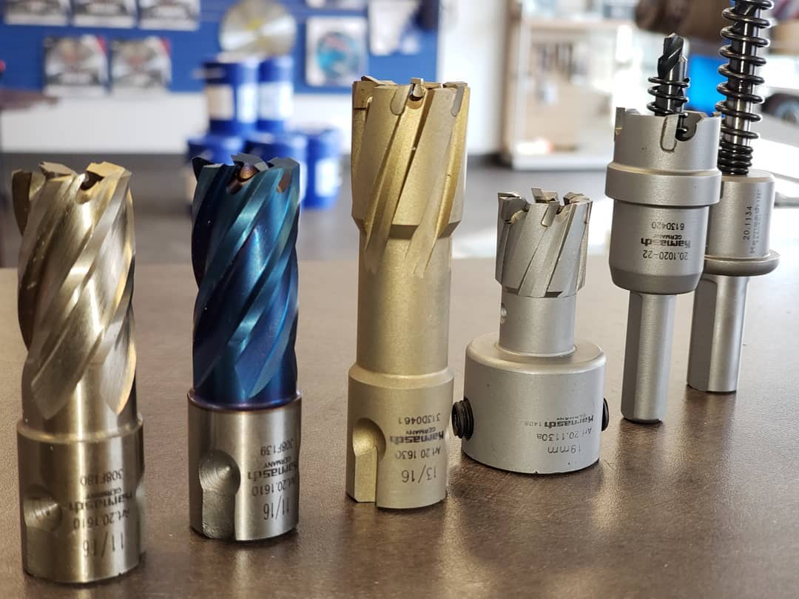
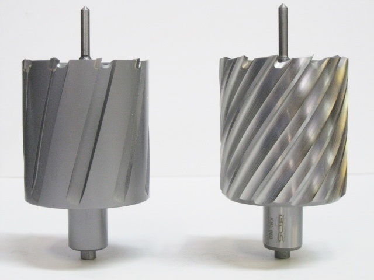
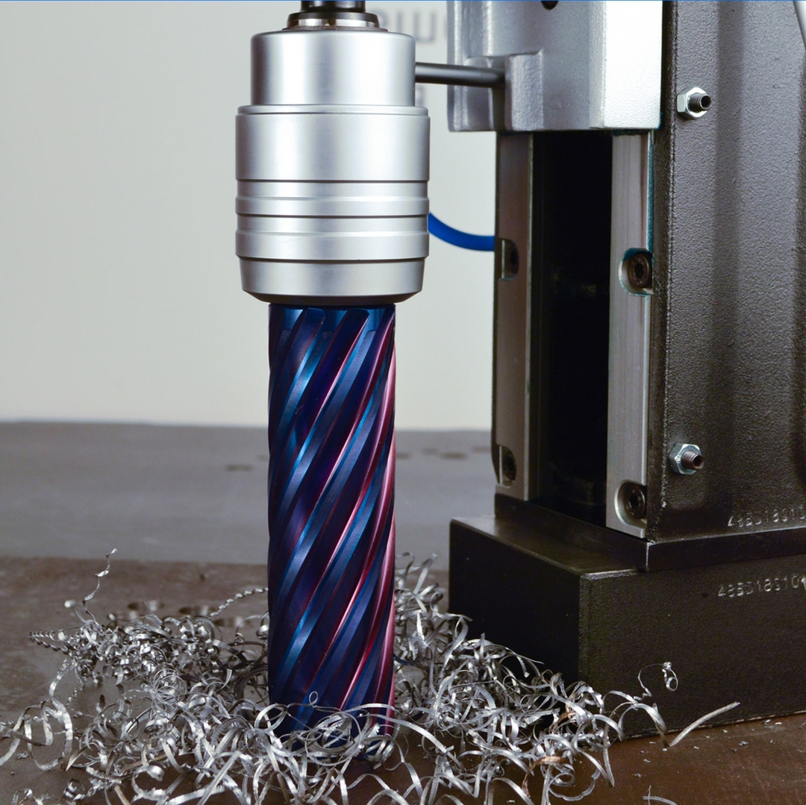
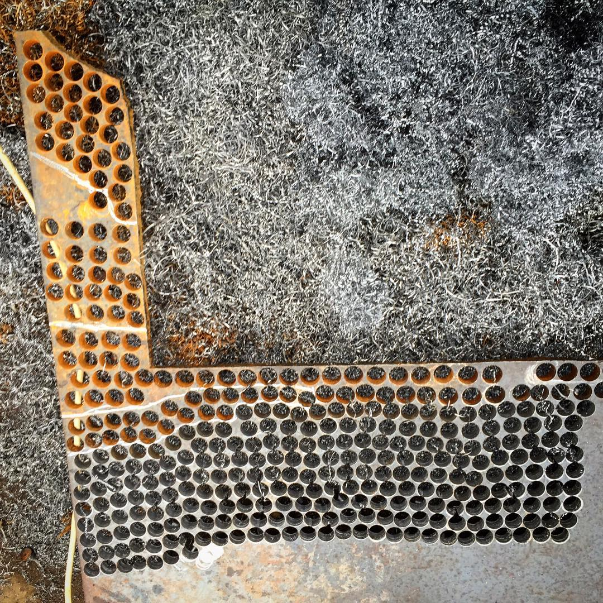
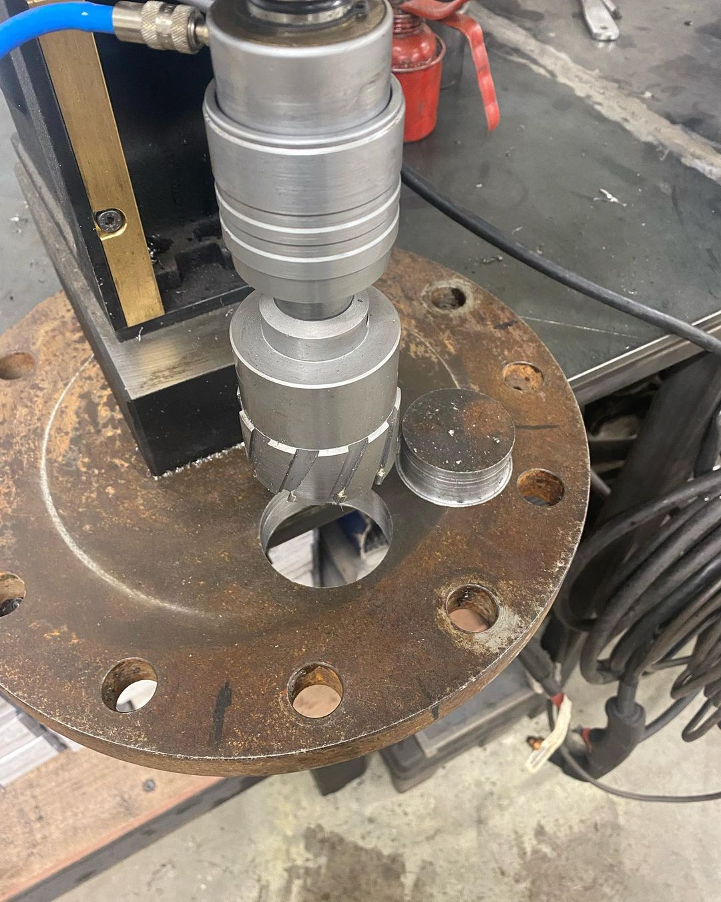

# Как выбрать корончатое сверло по металлу

> Предпросмотр редакционного черновика. Статья ещё не опубликована.

Для подбора сначала запишите диаметр и глубину отверстия, материал и форму заготовки, количество отверстий и условия работы. После этого сопоставьте рабочую длину, HSS или TCT, хвостовик, направляющий штифт и возможности магнитного станка. Режимы сверления и окончательную совместимость проверяйте по документации конкретной серии сверла и станка, а не по названию товарной группы.

*Корончатое сверло в магнитном сверлильном станке.*

## Сначала зафиксируйте задачу

Корончатое, или кольцевое, сверло снимает материал по периферии отверстия и оставляет внутри керн. Поэтому его выбор начинают не с бренда и цены, а с геометрии отверстия и условий резания. Производитель Hougen выделяет три базовых параметра: диаметр, глубину реза и материал заготовки. На практике к ним добавляют форму детали, количество отверстий, положение сверления и доступное оборудование.

| Параметр | Что уточнить | Где проверить |
|---|---|---|
| Отверстие | Требуемый диаметр и сквозное или глухое исполнение | Чертёж или техническое задание |
| Глубина | Фактическая толщина и условия выхода инструмента | Заготовка и рабочая длина серии |
| Материал | Марка или хотя бы тип металла и состояние поверхности | Техническое задание и рекомендации производителя |
| Станок | Модель, посадка, допустимый диаметр, рабочий ход и обороты | Паспорт станка |
| Оснастка | Хвостовик, направляющий штифт, переходник и СОЖ | Карточка серии и паспорт |
| Режим работы | Количество отверстий, положение сверления и доступ к зоне реза | Условия участка или монтажной площадки |

*Корончатые свёрла разных конструкций и диаметров.*

## Как выбрать диаметр и рабочую длину

Номинальный диаметр сверла сопоставляют с требуемым диаметром отверстия. Если посадка или допуск критичны, одной надписи на упаковке недостаточно: точность зависит также от станка, жёсткости установки, подачи, оборотов и состояния заготовки. Для ответственной операции нужно сверяться с документацией серии и требованиями чертежа.

Рабочая длина показывает допустимую глубину реза, а не общую длину инструмента. Для сквозного отверстия учитывают фактическую толщину детали, выход инструмента, удаление керна и стружки. Если требуется пройти несколько сложенных листов, стандартную геометрию нельзя автоматически считать подходящей: производитель отдельно выделяет сверла для пакетного сверления.

> Не выбирайте рабочую длину с минимальным запасом только по толщине детали. Сначала проверьте конструкцию конкретного сверла, направляющий штифт и условия выхода керна.

## HSS или TCT: как сравнивать материал режущей части

HSS и TCT — не две ступени качества, где один вариант всегда лучше другого. HSS-сверла из быстрорежущей стали применяют для широкого круга операций. Твердосплавные модели рассматривают для более твёрдых или абразивных материалов и режимов, под которые они рассчитаны. При этом производитель указывает, что твердосплавному инструменту могут требоваться другие обороты, поэтому замена HSS на TCT без проверки станка не гарантирует улучшения результата.

*Слева — корончатое сверло TCT, справа — HSS. Rohan von Indien, [CC BY-SA 3.0](https://creativecommons.org/licenses/by-sa/3.0/), [Wikimedia Commons](https://commons.wikimedia.org/wiki/File:Annular_Cutter.jpg).*

| Вопрос | HSS | TCT |
|---|---|---|
| Материал заготовки | Сверить применимость серии к материалу | Сверить применимость серии к твёрдому или абразивному материалу |
| Обороты | Проверить рекомендуемый диапазон серии | Проверить, может ли станок обеспечить требуемый режим |
| Условия работы | Учитывать подачу, охлаждение и жёсткость установки | Особенно проверить устойчивость установки и отсутствие ударной нагрузки |
| Решение | Выбирать по паспорту и задаче | Выбирать по паспорту и задаче, а не по принципу «дороже значит лучше» |

## Как проверить хвостовик и совместимость со станком

Хвостовик должен соответствовать держателю станка непосредственно или через разрешённый производителем переходник. Обозначение Weldon описывает систему крепления, но одного слова Weldon недостаточно: в каталогах встречаются разные размеры и комбинированные исполнения. В актуальной категории 7TOOL отдельно представлены Weldon 19, Weldon 19 с совместимой посадкой Nitto, Weldon 32 и другие варианты.

- Запишите точную модель станка и тип держателя.
- Сопоставьте хвостовик сверла с держателем или разрешённым переходником.
- Проверьте максимальный диаметр корончатого сверления и рабочий ход станка.
- Сверьте рекомендуемые обороты для материала и выбранной серии.
- Убедитесь, что направляющий штифт соответствует длине и конструкции сверла.

> Если модель станка неизвестна, сфотографируйте шильдик и посадочное место. Подбор по внешнему виду сверла или только по диаметру хвостовика создаёт риск несовместимости.

## Направляющий штифт, СОЖ и режим работы

Направляющий штифт выполняет сразу несколько функций: помогает выставить центр отверстия, открывает путь для подачи охлаждающей жидкости и выталкивает керн после завершения прохода. Поэтому его подбирают вместе со сверлом, учитывая конструкцию и рабочую длину конкретной серии.

Смазка и охлаждение помогают уменьшать нагрев, улучшать отвод стружки и сохранять качество поверхности. Но тип жидкости и способ подачи зависят от материала, положения сверления и требований производителя. Для вертикальной, горизонтальной или потолочной работы решение по СОЖ и безопасности должно опираться на руководство станка и правила участка.

*Корончатое сверление металла с образованием стружки.*

> Не назначайте обороты, подачу и СОЖ по универсальной таблице без проверки серии. Даже рекомендации производителя являются исходной точкой и корректируются по материалу, установке и состоянию инструмента.

## Ограничения применения

- Корончатое сверло не компенсирует люфт, недостаточную жёсткость или неправильное закрепление станка.
- Стандартная геометрия не должна автоматически применяться для нескольких сложенных деталей.
- Работа по криволинейной поверхности, по сварному шву или при неполном контакте требует отдельной проверки установки.
- Твердосплавное сверло не является универсальной заменой HSS, если станок не обеспечивает подходящий режим.
- Изношенный или повреждённый инструмент нельзя возвращать в работу только изменением подачи или оборотов.

Перед работой нужно следовать руководствам изготовителей сверла и станка, требованиям охраны труда и правилам конкретного участка. Эта статья помогает сформировать запрос на подбор, но не заменяет паспорт оборудования и технологическую карту операции.

*Серийное сверление отверстий корончатым сверлом.*

## Типовые ошибки и проверки перед заказом

| Ошибка | Риск | Проверка |
|---|---|---|
| Выбрать только диаметр | Не подходит рабочая длина или хвостовик | Добавить глубину, станок и посадку |
| Считать TCT универсально лучшим | Режим не соответствует материалу или станку | Сверить паспорт серии и доступные обороты |
| Использовать случайный штифт | Нет точного центрирования, подачи СОЖ или выброса керна | Подобрать штифт для конкретной длины и серии |
| Игнорировать закрепление | Вибрация, нестабильное отверстие и повреждение инструмента | Проверить поверхность, основание и жёсткость установки |
| Назначить режим по памяти | Перегрев, плохой отвод стружки или ускоренный износ | Проверить рекомендации изготовителя и состояние заготовки |
| Заказать без артикула | Путаница между похожими модификациями | Зафиксировать серию, артикул и все согласованные параметры |

*Готовое отверстие и извлечённый керн.*

## Что передать для инженерного подбора

Чтобы получить не общий список, а проверяемый вариант оснастки, передайте поставщику параметры задачи одним сообщением. В [каталоге корончатых свёрл 7TOOL](https://7tool.ru/c/koronchatye-sverla) можно сначала отфильтровать HSS, TCT, Weldon и рабочую длину, а затем уточнить совместимость и актуальную цену по конкретным артикулам.

- Требуемый диаметр и глубина отверстия.
- Материал, толщина и форма заготовки.
- Сквозное или глухое отверстие, одиночная деталь или пакет.
- Модель магнитного станка и тип держателя.
- Количество отверстий и положение сверления.
- Нужны ли направляющий штифт, переходник и СОЖ.
- Желаемый срок поставки и реквизиты для предложения с НДС.

> Актуальные цены и наличие следует смотреть в каталоге или подтверждать в предложении: их нельзя фиксировать в редакционной статье, потому что товарный фид обновляется отдельно.

## Частые вопросы

### Можно ли выбрать корончатое сверло только по диаметру отверстия?

Нет. Дополнительно нужны глубина реза, материал заготовки, хвостовик, модель и ограничения станка, подходящий направляющий штифт и условия подачи СОЖ.

### Что лучше для металла: HSS или TCT?

Универсального победителя нет. HSS и TCT выбирают по материалу, режиму, жёсткости установки и возможностям станка; рекомендации нужно проверять для конкретной серии.

### Что означает хвостовик Weldon 19?

Это обозначение распространённой системы крепления определённого размера. Совпадение слова Weldon ещё не подтверждает совместимость: нужно проверить размер, держатель станка и допустимый переходник.

### Зачем нужен направляющий штифт?

Он помогает выставить центр, участвует в подаче охлаждающей жидкости к зоне резания и выталкивает керн после прохода. Штифт подбирают под конструкцию и длину сверла.

### Какие данные нужны для подбора корончатого сверла?

Передайте диаметр и глубину отверстия, материал и форму детали, модель станка, хвостовик, количество отверстий и положение работы. Если станок неизвестен, приложите фотографию шильдика и держателя.

## Каталог

- [Корончатые свёрла по металлу](https://7tool.ru/c/koronchatye-sverla)
- [Корончатые свёрла HSS](https://7tool.ru/c/koronchatye-sverla/hss)
- [Твердосплавные корончатые свёрла TCT](https://7tool.ru/c/koronchatye-sverla/tct)
- [Корончатые свёрла Weldon 19](https://7tool.ru/c/koronchatye-sverla/weldon-19)
- [Магнитные сверлильные станки](https://7tool.ru/c/stanki-sverlilnye/magnitnye)

Передайте диаметр, глубину, материал, модель станка и тип хвостовика — мы проверим совместимость и подготовим предложение с актуальной ценой.

## Источники

- [Hougen: Basic Guide to Magnetic Drills & Annular Cutters](https://hougen.com/downloads/Hougen_Mag_Drill_%26_Annular_Cutter_Guide.pdf)
- [Hougen: Technical Cutter Info](https://hougen.com/technical-cutter-info/)
- [Euroboor: Portable Industrial Tools Catalogue 2024](https://www.euroboor.com/_clientfiles/catalogus/Catalogue_EN_2024_comp.pdf)
- [Категория корончатых свёрл 7TOOL](https://7tool.ru/c/koronchatye-sverla)
